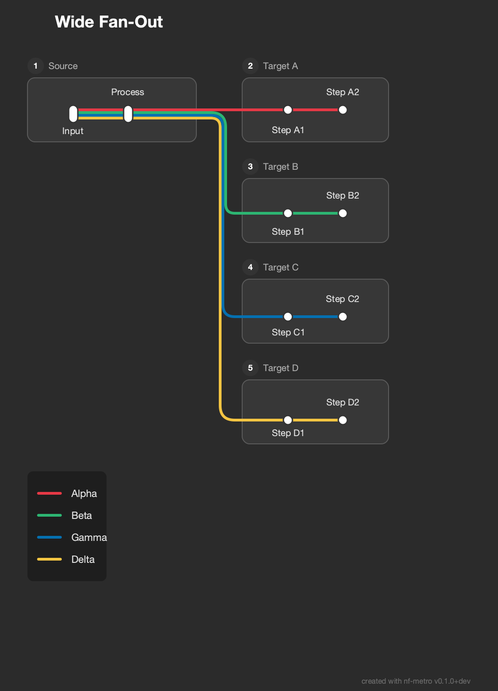
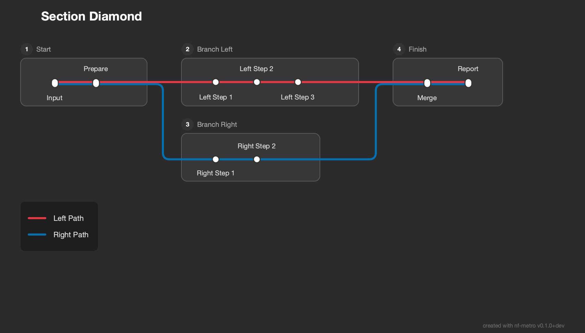
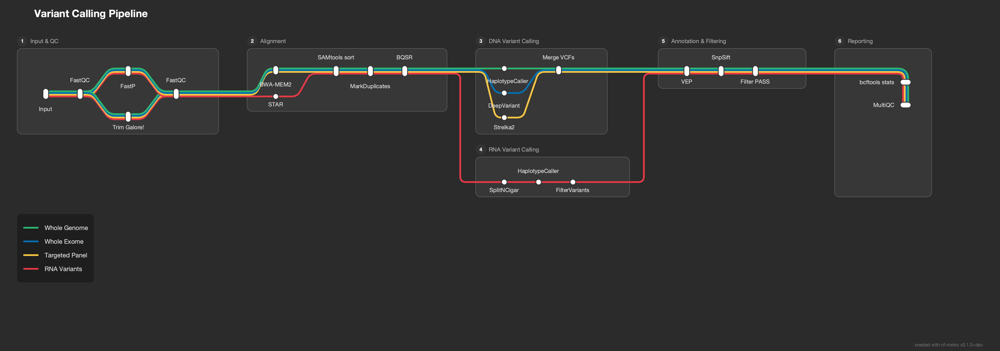
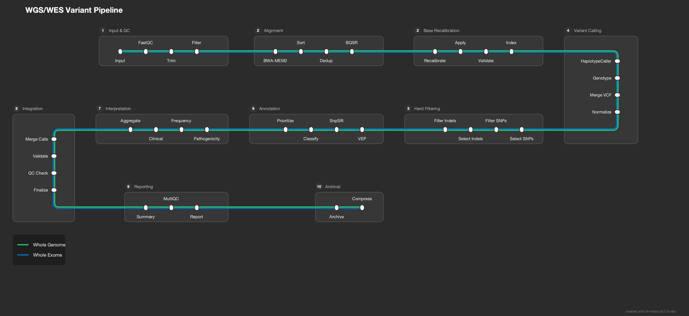
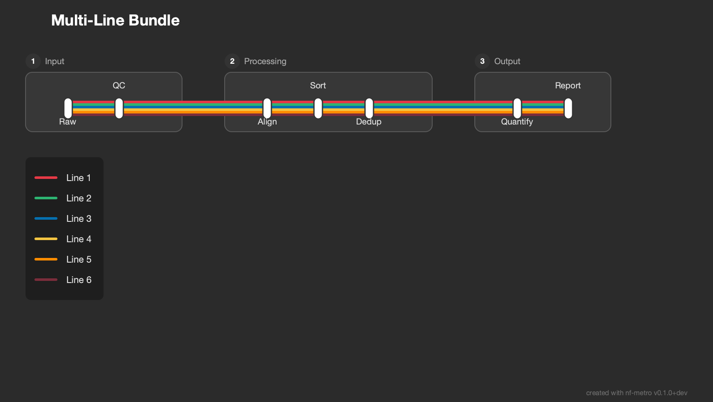
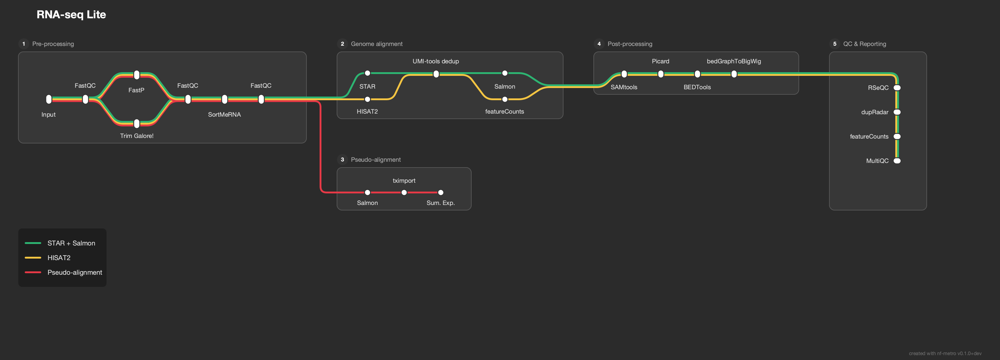

# nf-metro

Generate metro-map-style SVG diagrams from Mermaid graph definitions with `%%metro` directives. Designed for visualizing bioinformatics pipeline workflows (e.g., nf-core pipelines) as transit-style maps where each analysis route is a colored "metro line."

<picture>
  <source media="(prefers-color-scheme: dark)" srcset="https://raw.githubusercontent.com/pinin4fjords/nf-metro/main/examples/rnaseq_light_animated.svg">
  <source media="(prefers-color-scheme: light)" srcset="https://raw.githubusercontent.com/pinin4fjords/nf-metro/main/examples/rnaseq_light_animated.svg">
  
</picture>

## Installation

```bash
pip install nf-metro
```

For development:

```bash
pip install -e ".[dev]"
```

Requires Python 3.10+.

## Quick start

Render a metro map from a `.mmd` file:

```bash
nf-metro render examples/simple_pipeline.mmd -o pipeline.svg
```

Validate your input without rendering:

```bash
nf-metro validate examples/simple_pipeline.mmd
```

Inspect structure (sections, lines, stations):

```bash
nf-metro info examples/simple_pipeline.mmd
```

## CLI reference

### `nf-metro render`

Render a Mermaid metro map definition to SVG.

```
nf-metro render [OPTIONS] INPUT_FILE
```

| Option | Default | Description |
|--------|---------|-------------|
| `-o`, `--output PATH` | `<input>.svg` | Output SVG file path |
| `--theme [nfcore\|light]` | `nfcore` | Visual theme |
| `--width INTEGER` | auto | SVG width in pixels |
| `--height INTEGER` | auto | SVG height in pixels |
| `--x-spacing FLOAT` | `60` | Horizontal spacing between layers |
| `--y-spacing FLOAT` | `40` | Vertical spacing between tracks |
| `--max-layers-per-row INTEGER` | auto | Max layers before folding to next row |
| `--animate / --no-animate` | off | Add animated balls traveling along lines |
| `--debug / --no-debug` | off | Show debug overlay (ports, hidden stations, edge waypoints) |
| `--logo PATH` | none | Logo image path (overrides `%%metro logo:` directive) |

The `--logo` flag lets you use the same `.mmd` file with different logos for dark/light themes:

```bash
nf-metro render pipeline.mmd -o pipeline_dark.svg --theme nfcore --logo logo_dark.png
nf-metro render pipeline.mmd -o pipeline_light.svg --theme light --logo logo_light.png
```

### `nf-metro validate`

Check a `.mmd` file for errors without producing output.

```
nf-metro validate INPUT_FILE
```

### `nf-metro info`

Print a summary of the parsed map: sections, lines, stations, and edges.

```
nf-metro info INPUT_FILE
```

## Examples

The [`examples/`](examples/) directory contains ready-to-render `.mmd` files:

| Example | Description |
|---------|-------------|
| [`simple_pipeline.mmd`](examples/simple_pipeline.mmd) | Minimal two-line pipeline with no sections |
| [`rnaseq_auto.mmd`](examples/rnaseq_auto.mmd) | nf-core/rnaseq with fully auto-inferred layout |
| [`rnaseq_sections.mmd`](examples/rnaseq_sections.mmd) | nf-core/rnaseq with manual grid overrides |

### Topology gallery

The [`examples/topologies/`](examples/topologies/) directory has 15 examples covering a range of layout patterns. See the [topology README](examples/topologies/README.md) for descriptions and rendered previews.

A few highlights:

| | | |
|:---:|:---:|:---:|
| **Wide Fan-Out** | **Section Diamond** | **Variant Calling** |
|  |  |  |
| **Fold Serpentine** | **Multi-Line Bundle** | **RNA-seq Lite** |
|  |  |  |

## Input format

Input files use a subset of Mermaid `graph LR` syntax extended with `%%metro` directives. The format has three layers: **global directives** that configure the overall map, **section directives** inside `subgraph` blocks that control section layout, and **edges** that define connections between stations.

### Walkthrough: nf-core/rnaseq

The full example is at [`examples/rnaseq_sections.mmd`](examples/rnaseq_sections.mmd). Here's how each part works.

#### Global directives

```
%%metro title: nf-core/rnaseq
%%metro logo: examples/nf-core-rnaseq_logo_dark.png
%%metro style: dark
```

- `title:` sets the map title (shown top-left unless a logo is provided)
- `logo:` embeds a PNG image in place of the text title
- `style:` selects a theme (`dark` or `light`)

#### Lines (routes)

Each metro line represents a distinct path through the pipeline. Lines are defined with an ID, display name, and color:

```
%%metro line: star_rsem | Aligner: STAR, Quantification: RSEM | #0570b0
%%metro line: star_salmon | Aligner: STAR, Quantification: Salmon (default) | #2db572
%%metro line: hisat2 | Aligner: HISAT2, Quantification: None | #f5c542
%%metro line: pseudo_salmon | Pseudo-aligner: Salmon, Quantification: Salmon | #e63946
%%metro line: pseudo_kallisto | Pseudo-aligner: Kallisto, Quantification: Kallisto | #7b2d3b
```

In the rnaseq pipeline, each line corresponds to a parameter-driven analysis route. All five lines share the preprocessing section, then diverge based on aligner choice.

#### Grid placement

Sections are placed on a grid automatically via topological sort, but explicit positions can be set:

```
%%metro grid: postprocessing | 2,0,2
%%metro grid: qc_report | 1,2,1,2
```

The format is `section_id | col,row[,rowspan[,colspan]]`. In this example:
- `postprocessing` is pinned to column 2, row 0, spanning 2 rows vertically
- `qc_report` is pinned to column 1, row 2, spanning 2 columns horizontally

#### Legend

```
%%metro legend: bl
```

Position the legend: `tl`, `tr`, `bl`, `br` (corners), `bottom`, `right`, or `none`.

#### Sections

Sections are Mermaid `subgraph` blocks. Each section is laid out independently, then placed on the grid:

```
graph LR
    subgraph preprocessing [Pre-processing]
        %%metro exit: right | star_salmon, star_rsem, hisat2
        %%metro exit: bottom | pseudo_salmon, pseudo_kallisto
        cat_fastq[cat fastq]
        fastqc_raw[FastQC]
        ...
    end
```

**Section directives:**

- `%%metro entry: <side> | <line_ids>` - declares which lines enter this section and from which side (`left`, `right`, `top`, `bottom`)
- `%%metro exit: <side> | <line_ids>` - declares which lines exit and to which side
- `%%metro direction: <dir>` - section flow direction: `LR` (default), `RL` (right-to-left), or `TB` (top-to-bottom)

Entry/exit hints control port placement on section boundaries. A section can have exit hints on multiple sides (e.g., preprocessing exits right for aligners and bottom for pseudo-aligners), but all lines from a section leave through a single exit port. If all exit hints point to one side, that side is used; otherwise it defaults to `right`.

#### Section directions

Most sections flow left-to-right (`LR`, the default). Two other directions are useful for layout:

**Top-to-bottom (`TB`)** - used for the Post-processing section, which acts as a vertical connector carrying lines downward:

```
    subgraph postprocessing [Post-processing]
        %%metro direction: TB
        %%metro entry: left | star_salmon, star_rsem, hisat2
        %%metro exit: bottom | star_salmon, star_rsem, hisat2
        samtools[SAMtools]
        picard[Picard]
        ...
    end
```

**Right-to-left (`RL`)** - used for the QC section, which flows backward to create a serpentine layout:

```
    subgraph qc_report [Quality control & reporting]
        %%metro direction: RL
        %%metro entry: top | star_salmon, star_rsem, hisat2
        rseqc[RSeQC]
        preseq[Preseq]
        ...
    end
```

#### Stations and edges

Stations use Mermaid node syntax. Edges carry comma-separated line IDs to indicate which routes use that connection:

```
        cat_fastq[cat fastq]
        fastqc_raw[FastQC]

        cat_fastq -->|star_salmon,star_rsem,hisat2,pseudo_salmon,pseudo_kallisto| fastqc_raw
```

All five lines pass through this edge. Later, lines diverge:

```
        star -->|star_rsem| rsem
        star -->|star_salmon| umi_tools_dedup
        hisat2_align -->|hisat2| umi_tools_dedup
```

Here different lines take different paths through the section, creating the visual fork in the metro map.

#### Inter-section edges

Edges between stations in different sections go outside all `subgraph`/`end` blocks:

```
    %% Inter-section edges
    sortmerna -->|star_salmon,star_rsem| star
    sortmerna -->|hisat2| hisat2_align
    sortmerna -->|pseudo_salmon| salmon_pseudo
    sortmerna -->|pseudo_kallisto| kallisto
    stringtie -->|star_salmon,star_rsem,hisat2| rseqc
```

These are automatically rewritten into port-to-port connections with junction stations at fan-out points. You just specify the source and target stations directly.

### Directive reference

| Directive | Scope | Description |
|-----------|-------|-------------|
| `%%metro title: <text>` | Global | Map title |
| `%%metro logo: <path>` | Global | Logo image (replaces title text) |
| `%%metro style: <name>` | Global | Theme: `dark`, `light` |
| `%%metro line: <id> \| <name> \| <color>` | Global | Define a metro line |
| `%%metro grid: <section> \| <col>,<row>[,<rowspan>[,<colspan>]]` | Global | Pin section to grid position |
| `%%metro legend: <position>` | Global | Legend position: `tl`, `tr`, `bl`, `br`, `bottom`, `right`, `none` |
| `%%metro file: <station> \| <label>` | Global | Mark a station as a file terminus with a document icon |
| `%%metro entry: <side> \| <lines>` | Section | Entry port hint |
| `%%metro exit: <side> \| <lines>` | Section | Exit port hint |
| `%%metro direction: <dir>` | Section | Flow direction: `LR`, `RL`, `TB` |

## License

[MIT](LICENSE)
