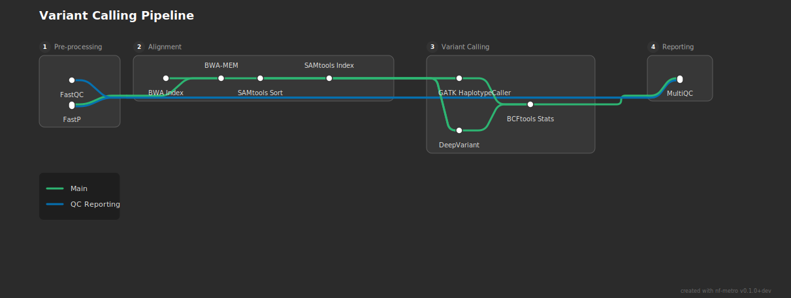

# Importing from Nextflow

nf-metro can convert Nextflow's built-in DAG output into a metro map. This works best for simple pipelines with a handful of subworkflows. For complex pipelines like those in nf-core, direct conversion is unlikely to produce a good diagram -- you will need to hand-write or heavily edit the `.mmd` file. Improving this is an active area of development.

## Generating a Nextflow DAG

Nextflow can export its pipeline DAG in mermaid format:

```bash
nextflow run my_pipeline.nf -preview -with-dag dag.mmd
```

The `-preview` flag skips execution and just generates the DAG. The resulting file uses Nextflow's `flowchart TB` mermaid syntax, which nf-metro cannot render directly but can convert.

## Direct rendering

The quickest way to get a metro map is to convert and render in one step with the `--from-nextflow` flag. The following examples show what you get straight out of the box.

### Flat pipeline (no subworkflows)

A simple five-process pipeline with no subworkflows:

```groovy
workflow {
    reads_ch = Channel.of(["sample1", [file("reads/s1_1.fq.gz"), file("reads/s1_2.fq.gz")]])
    reference_ch = Channel.of(file("genome.fa"))

    FASTQC(reads_ch)
    TRIM_READS(reads_ch)
    ALIGN(TRIM_READS.out, reference_ch.collect())
    SORT_BAM(ALIGN.out)
    MULTIQC(FASTQC.out.zip.mix(SORT_BAM.out.map { it[1] }).collect())
}
```

```bash
nextflow run flat_pipeline.nf -preview -with-dag dag.mmd
nf-metro render dag.mmd -o pipeline.svg --from-nextflow
```


With no subworkflows everything lands in a single section. The converter assigns one "main" line following the longest path. This is about as clean as it gets.

### Pipeline with subworkflows

A pipeline with three subworkflows (Preprocess, Alignment, Quantification) plus a standalone MultiQC process:

```groovy
workflow PREPROCESS {
    take: reads
    main:
    FASTQC(reads)
    TRIMGALORE(reads)
    emit:
    reads = TRIMGALORE.out.reads
    fastqc_zip = FASTQC.out.zip
    trim_log = TRIMGALORE.out.log
}

workflow ALIGNMENT {
    take: reads; genome; gtf
    main:
    STAR_GENOMEGENERATE(genome, gtf)
    STAR_ALIGN(reads, STAR_GENOMEGENERATE.out.index.collect())
    SAMTOOLS_SORT(STAR_ALIGN.out.bam)
    SAMTOOLS_INDEX(SAMTOOLS_SORT.out.bam)
    emit:
    bam = SAMTOOLS_SORT.out.bam
    star_log = STAR_ALIGN.out.log
}

workflow QUANTIFICATION {
    take: bam; gtf
    main:
    SALMON_QUANT(bam, gtf)
    emit:
    results = SALMON_QUANT.out.results
}

workflow {
    PREPROCESS(reads_ch)
    ALIGNMENT(PREPROCESS.out.reads, genome_ch, gtf_ch)
    QUANTIFICATION(ALIGNMENT.out.bam, gtf_ch)
    MULTIQC(/* all logs */)
}
```

```bash
nextflow run with_subworkflows.nf -preview -with-dag dag.mmd
nf-metro render dag.mmd -o pipeline.svg --from-nextflow
```


The converter maps each subworkflow to a section and auto-creates a "Reporting" section for the standalone MultiQC. It detects bypass lines (edges skipping sections, like QC metrics going from Preprocess directly to Reporting) and spur lines (dead-end processes like Samtools Index).

### Variant calling pipeline (diamond pattern)

A pipeline where two variant callers (GATK and DeepVariant) both receive input from the same alignment step and reconverge at BCFtools Stats:

```groovy
workflow VARIANT_CALLING {
    take: bam; bai; genome
    main:
    bam_bai = bam.join(bai)
    GATK_HAPLOTYPECALLER(bam_bai, genome.collect())
    DEEPVARIANT(bam_bai, genome.collect())
    BCFTOOLS_STATS(GATK_HAPLOTYPECALLER.out.vcf.mix(DEEPVARIANT.out.vcf))
    emit:
    stats = BCFTOOLS_STATS.out.stats
}

workflow {
    PREPROCESS(reads_ch)
    ALIGNMENT(PREPROCESS.out.reads, genome_ch)
    VARIANT_CALLING(ALIGNMENT.out.bam, ALIGNMENT.out.bai, genome_ch)
    MULTIQC(/* all logs */)
}
```

```bash
nextflow run variant_calling.nf -preview -with-dag dag.mmd
nf-metro render dag.mmd -o pipeline.svg --from-nextflow
```


The diamond fan-out/fan-in in the Variant Calling section renders cleanly.

## Hand-tuning the output

For anything beyond a toy pipeline, the two-step workflow gives better results. Convert first, edit the `.mmd`, then render:

```bash
nf-metro convert dag.mmd -o pipeline.mmd --title "My Pipeline"
# edit pipeline.mmd
nf-metro render pipeline.mmd -o pipeline.svg
```

Here is what the converter produces for the variant calling pipeline:

```text
%%metro title: Preprocess / Alignment / Variant Calling Pipeline
%%metro style: dark
%%metro line: main | Main | #2db572
%%metro line: preprocess_reporting | Preprocess - Reporting | #0570b0

graph LR
    subgraph preprocess [Preprocess]
        fastqc([Fastqc])
        fastp([Fastp])
    end

    subgraph alignment [Alignment]
        bwa_index([Bwa Index])
        bwa_mem([Bwa Mem])
        samtools_sort([Samtools Sort])
        samtools_index([Samtools Index])

        bwa_index -->|main| bwa_mem
        bwa_mem -->|main| samtools_sort
        samtools_sort -->|main| samtools_index
    end

    subgraph variant_calling [Variant Calling]
        gatk_haplotypecaller([Gatk Haplotypeca])
        deepvariant([Deepvariant])
        bcftools_stats([Bcftools Stats])

        gatk_haplotypecaller -->|main| bcftools_stats
        deepvariant -->|main| bcftools_stats
    end

    subgraph reporting [Reporting]
        multiqc([Multiqc])
    end

    %% Inter-section edges
    bcftools_stats -->|main| multiqc
    fastp -->|main| bwa_mem
    samtools_sort -->|main| gatk_haplotypecaller
    samtools_sort -->|main| deepvariant
    samtools_index -->|main| gatk_haplotypecaller
    samtools_index -->|main| deepvariant
    fastqc -->|preprocess_reporting| multiqc
    fastp -->|preprocess_reporting| multiqc
```

After editing -- cleaning up labels, renaming the bypass line, and adding a proper title -- the `.mmd` becomes:

```text
%%metro title: Variant Calling Pipeline
%%metro style: dark
%%metro line: main | Main | #2db572
%%metro line: qc | QC Reporting | #0570b0

graph LR
    subgraph preprocess [Pre-processing]
        fastqc[FastQC]
        fastp[FastP]
    end

    subgraph alignment [Alignment]
        bwa_index[BWA Index]
        bwa_mem[BWA-MEM]
        samtools_sort[SAMtools Sort]
        samtools_index[SAMtools Index]

        bwa_index -->|main| bwa_mem
        bwa_mem -->|main| samtools_sort
        samtools_sort -->|main| samtools_index
    end

    subgraph variant_calling [Variant Calling]
        gatk[GATK HaplotypeCaller]
        deepvariant[DeepVariant]
        bcftools[BCFtools Stats]

        gatk -->|main| bcftools
        deepvariant -->|main| bcftools
    end

    subgraph reporting [Reporting]
        multiqc[MultiQC]
    end

    %% Inter-section edges
    fastp -->|main| bwa_mem
    samtools_sort -->|main| gatk
    samtools_sort -->|main| deepvariant
    samtools_index -->|main| gatk
    samtools_index -->|main| deepvariant
    bcftools -->|main| multiqc
    fastqc -->|qc| multiqc
    fastp -->|qc| multiqc
```



The changes are small but the diagram reads better: proper casing on labels (BWA-MEM, SAMtools, GATK HaplotypeCaller), a meaningful line name ("QC Reporting" instead of "Preprocess - Reporting"), and a cleaner title. See the [Guide](guide.md) for the full `.mmd` format reference.

## Adding file icons

One of the most useful features for Nextflow pipeline diagrams is marking input and output files with document icons. The `%%metro file:` directive pairs a station ID with a label, and when that station has a blank label (`[ ]`), it renders as a document icon instead of a pill-shaped station marker.

Starting from the hand-tuned variant calling example above, here is what changes:

1. Add `%%metro file:` directives at the top of the file, one per file terminus:

    ```text
    %%metro file: fastq_in | FASTQ
    %%metro file: ref_in | FASTA
    %%metro file: vcf_out | VCF
    %%metro file: report_out | HTML
    ```

2. Add blank terminus stations (`[ ]`) at the input and output points of your pipeline. The station ID must match the `%%metro file:` directive:

    ```text
    fastq_in[ ]
    ```

3. Connect them to the pipeline with normal edges:

    ```text
    fastq_in -->|main,qc| fastp
    ```

Here is the full `.mmd` with file icons added:

```text
%%metro title: Variant Calling Pipeline
%%metro style: dark
%%metro file: fastq_in | FASTQ
%%metro file: ref_in | FASTA
%%metro file: vcf_out | VCF
%%metro file: report_out | HTML
%%metro line: main | Main | #2db572
%%metro line: qc | QC Reporting | #0570b0

graph LR
    subgraph preprocess [Pre-processing]
        fastq_in[ ]
        fastqc[FastQC]
        fastp[FastP]
        fastq_in -->|main,qc| fastp
        fastq_in -->|qc| fastqc
    end

    subgraph alignment [Alignment]
        ref_in[ ]
        bwa_index[BWA Index]
        bwa_mem[BWA-MEM]
        samtools_sort[SAMtools Sort]
        samtools_index[SAMtools Index]

        ref_in -->|main| bwa_index
        bwa_index -->|main| bwa_mem
        bwa_mem -->|main| samtools_sort
        samtools_sort -->|main| samtools_index
    end

    subgraph variant_calling [Variant Calling]
        gatk[GATK HaplotypeCaller]
        deepvariant[DeepVariant]
        bcftools[BCFtools Stats]
        vcf_out[ ]

        gatk -->|main| bcftools
        deepvariant -->|main| bcftools
        bcftools -->|main| vcf_out
    end

    subgraph reporting [Reporting]
        multiqc[MultiQC]
        report_out[ ]
        multiqc -->|qc| report_out
    end

    %% Inter-section edges
    fastp -->|main| bwa_mem
    samtools_sort -->|main| gatk
    samtools_sort -->|main| deepvariant
    samtools_index -->|main| gatk
    samtools_index -->|main| deepvariant
    bcftools -->|qc| multiqc
    fastqc -->|qc| multiqc
    fastp -->|qc| multiqc
```


The FASTQ icon at the start of Pre-processing and the FASTA icon at the start of Alignment show where data enters the pipeline. The VCF icon at the end of Variant Calling and the HTML icon in Reporting show where results are written. This makes the diagram immediately readable to someone unfamiliar with the pipeline.

For a more complex example with multiple file icons, see the nf-core/rnaseq diagram at [`examples/rnaseq_sections.mmd`](https://github.com/pinin4fjords/nf-metro/blob/main/examples/rnaseq_sections.mmd), which uses FASTQ input icons and HTML report output icons across several sections.

## How the converter works

Nextflow's `-with-dag` output contains three types of nodes: processes (the actual pipeline steps), channels/values (data plumbing), and operators (Nextflow internals like `mix` and `collect`). Here is the raw DAG for the flat pipeline example:

```text
flowchart TB
    subgraph " "
    v0["Channel.of"]
    v1["Channel.of"]
    end
    v2(["FASTQC"])
    v4(["TRIM_READS"])
    v6(["ALIGN"])
    v7(["SORT_BAM"])
    v11(["MULTIQC"])
    v5(( ))
    v8(( ))
    v0 --> v2
    v0 --> v4
    v1 --> v5
    v4 --> v6
    v5 --> v6
    v6 --> v7
    v7 --> v8
    v2 --> v8
    v8 --> v11
```

The converter:

1. **Drops non-process nodes** -- channel nodes (`v0["Channel.of"]`), value nodes (`v1["Channel.of"]`), and operator nodes (`v5(( ))`, `v8(( ))`) are removed. Only stadium-shaped process nodes like `v2(["FASTQC"])` are kept.

2. **Reconnects edges** -- edges that went through dropped nodes are stitched back together. For example, `SORT_BAM --> v8 --> MULTIQC` becomes `SORT_BAM --> MULTIQC`, and `FASTQC --> v8 --> MULTIQC` becomes `FASTQC --> MULTIQC`.

3. **Maps subworkflows to sections** -- Nextflow subworkflows become nf-metro `subgraph` sections. Processes not in any subworkflow are grouped into auto-generated sections.

4. **Assigns metro lines** -- the longest path gets the "main" line. Edges that skip sections get their own bypass lines. Dead-end processes get spur lines.

5. **Cleans up labels** -- `SCREAMING_SNAKE_CASE` becomes `Title Case`, and long names are abbreviated.

The result for this example:

```text
%%metro title: Pipeline
%%metro style: dark
%%metro line: main | Main | #2db572

graph LR
    subgraph pipeline [Pipeline]
        fastqc([Fastqc])
        trim_reads([Trim Reads])
        align([Align])
        sort_bam([Sort Bam])
        multiqc([Multiqc])

        fastqc -->|main| multiqc
        trim_reads -->|main| align
        align -->|main| sort_bam
        sort_bam -->|main| multiqc
    end
```
