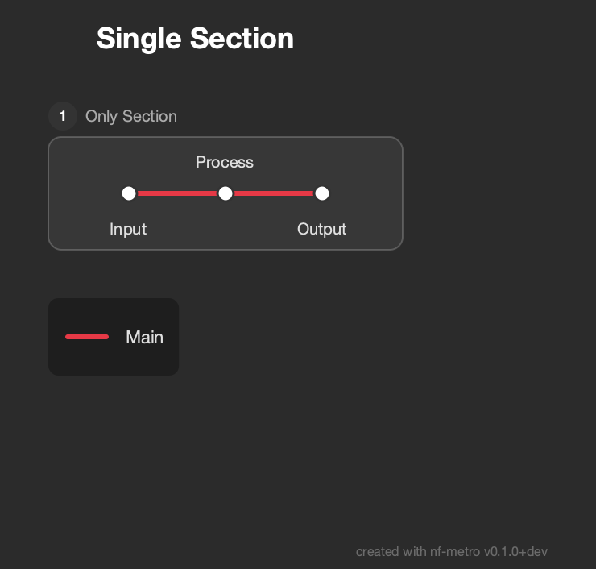
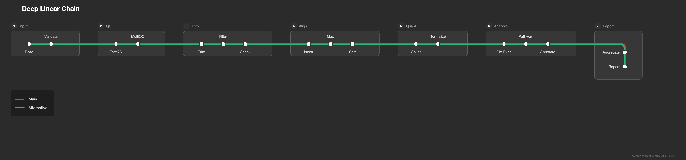
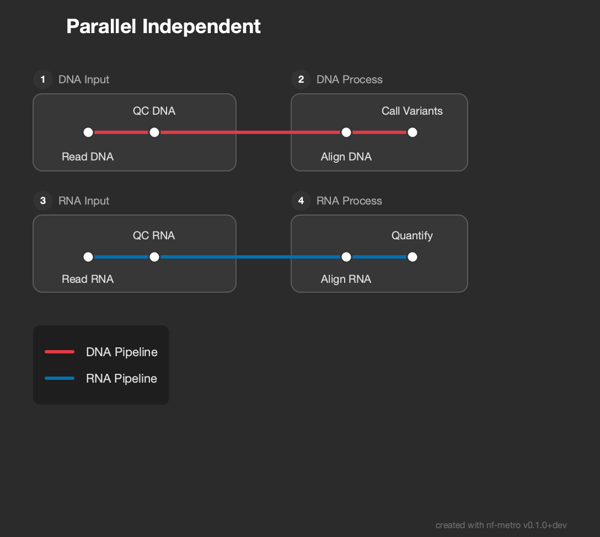
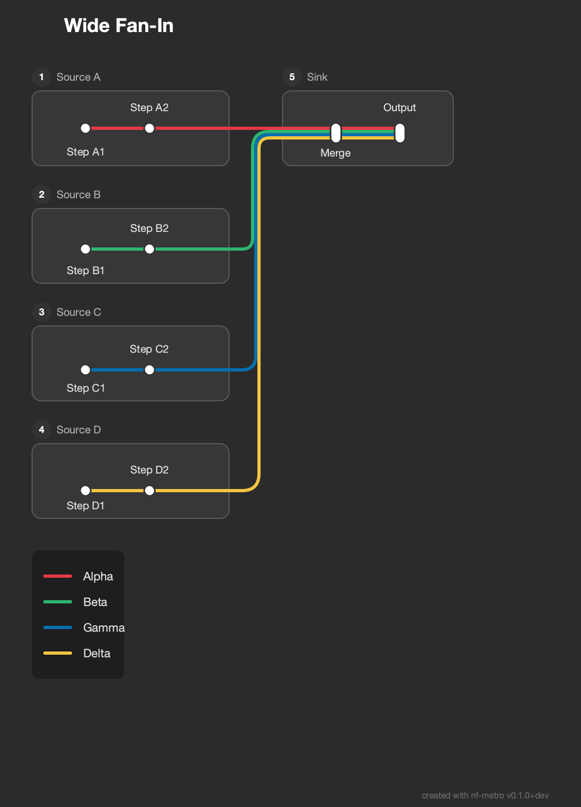
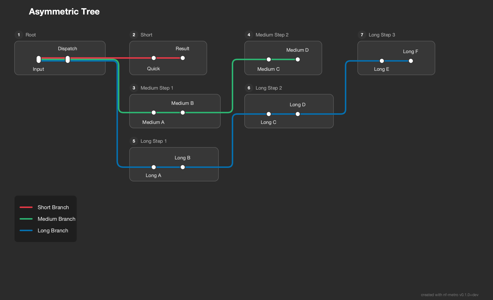
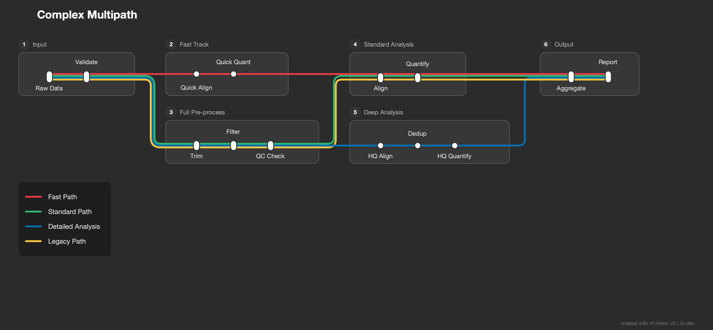
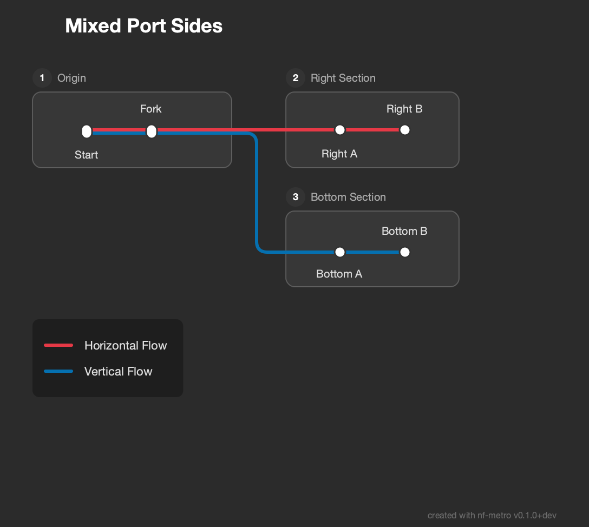
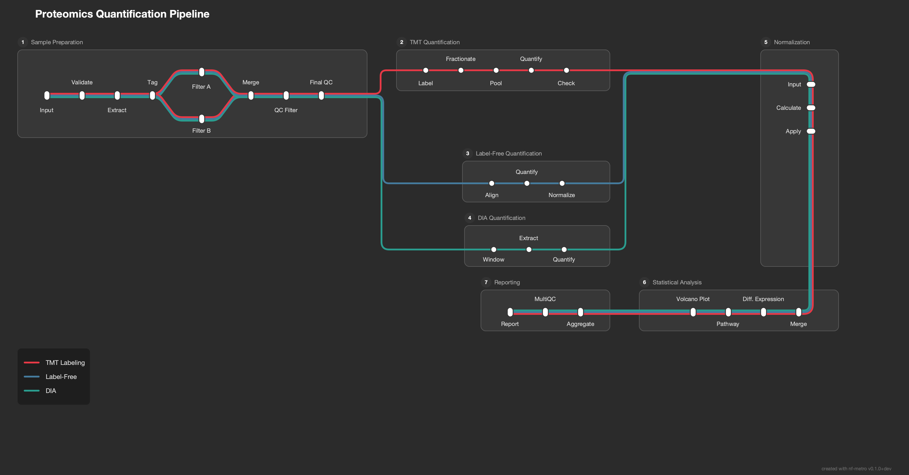
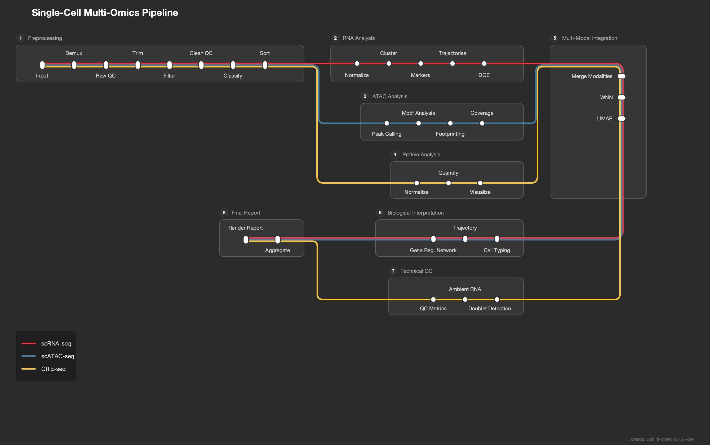

# Topology Examples

Example `.mmd` files demonstrating a range of pipeline topologies and the layout patterns they produce. Each example exercises different aspects of the auto-layout engine.

To render all examples:

```bash
nf-metro render examples/topologies/wide_fan_out.mmd -o /tmp/wide_fan_out.svg
```

---

## Simple Topologies

### Single Section

A minimal pipeline with one section and one line. Tests the simplest case: no ports, no inter-section routing, no grid placement.



### Deep Linear Chain

Seven sections connected in a straight chain with two lines. Exercises the grid fold threshold, where sections wrap to a second row when the chain gets too long.



### Parallel Independent

Two completely disconnected two-section pipelines (DNA and RNA). Tests row stacking of independent components that share no edges.



---

## Fan-out and Fan-in

### Wide Fan-Out

One source section fanning out to four target sections, each carrying a different line. Tests junction creation, vertical stacking of sections in a single column, and port spacing when many lines diverge at once.


### Wide Fan-In

Four source sections converging into one target section. The inverse of fan-out: tests bundle ordering around L-shaped corners when multiple entry edges arrive from stacked sources.



### Section Diamond

A section-level fork-join: one source fans out to two parallel sections, which then reconverge into a single sink. Tests both fan-out junction creation and fan-in routing in the same topology.


---

## Branching and Multipath

### Asymmetric Tree

One root section branching into three paths of different depths (1, 2, and 3 sections deep). Tests unbalanced tree layout where branches occupy different numbers of grid columns.



### Complex Multipath

Four lines taking different routes through six sections. Some lines skip sections entirely, others take detours through extra sections. Tests global bundle position reservation: when a line splits off and later rejoins, it returns to the same slot in the bundle.



---

## Multi-line Bundles

### Multi-Line Bundle

Six lines travelling through the same three-section chain. Tests dense bundle rendering: station pill height, line offset stacking, and routing of thick bundles through inter-section gaps.


### Mixed Port Sides

A section with both RIGHT and BOTTOM exits, sending lines in two directions. Tests multi-side exit port placement and the combination of horizontal and vertical inter-section routing from the same source.



---

## Realistic Pipelines

### RNA-seq Lite

A simplified RNA-seq pipeline with three analysis routes (STAR + Salmon, HISAT2, pseudo-alignment) diverging after a shared preprocessing section. Includes diamond patterns (FastP/Trim Galore) and line reconvergence at post-processing.


### Variant Calling Pipeline

A variant calling pipeline with four lines (Whole Genome, Whole Exome, Targeted Panel, RNA Variants) sharing alignment but diverging to different callers before reconverging at annotation. Tests complex fork-join patterns with asymmetric branch depths.


---

## Fold Topologies

These examples trigger the auto-layout engine's **fold logic**, which wraps long pipelines into a serpentine layout when cumulative station layers exceed the fold threshold (default 15 columns). The threshold is configurable via `--max-layers-per-row`:

```bash
# Narrower layout with more folds
nf-metro render examples/topologies/deep_linear.mmd -o output.svg --max-layers-per-row 6

# Wider layout with fewer folds
nf-metro render examples/topologies/deep_linear.mmd -o output.svg --max-layers-per-row 20
```

### Fold Fan-Across

Three lines (TMT, Label-Free, DIA) diverge from a wide preprocessing section into three stacked quantification sections, then converge at a fold section (Normalization) before continuing on the return row. Tests junction creation across fold boundaries, rowspan optimization for the TB bridge, and post-fold RL direction inference.



### Fold Double (Serpentine)

A ten-section linear pipeline with two fold points, producing a true serpentine layout: LR on row 0, RL on row 1, LR on row 2. Tests the col_step zigzag toggle, ensuring the third row flows correctly instead of producing negative grid columns.


### Fold Stacked Branch

Three stacked analysis sections (RNA, ATAC, Protein) feed into a fold section (Integration) that fans out to two stacked targets (Biological Interpretation, Technical QC) on the return row, converging into a final report. Tests rowspan optimization, fan-out from a TB fold section, and post-fold stacked branching.


